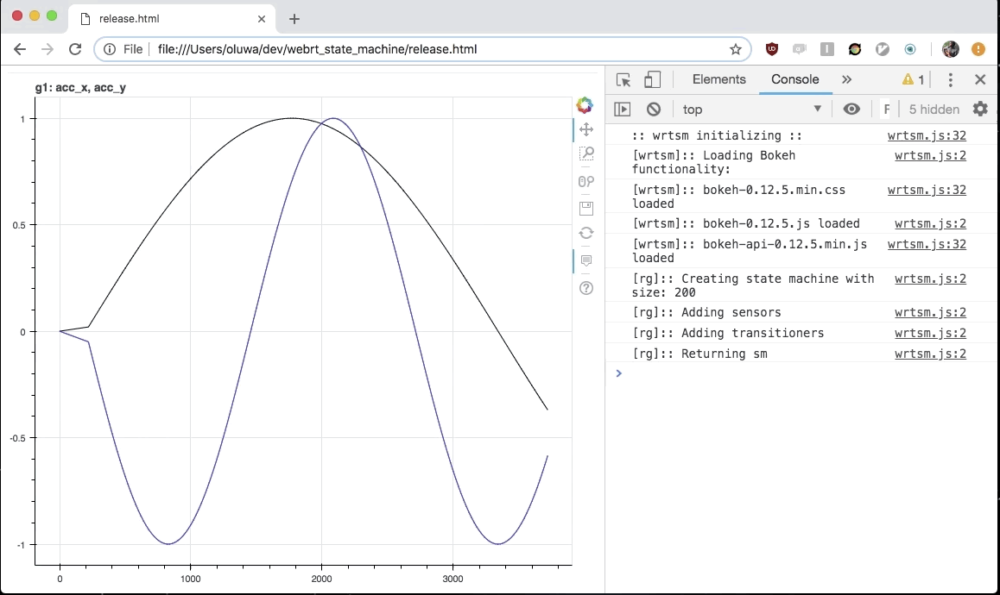

# nFLOW

nFLOW (Node Flow) is a javascript library that was built for protyping and implementing real time detection and feedback systems. Data is piped in realtime via websockets into a configurable state machine, which allows visualization of both raw and derived data features. Both raw data and derived features trigger state transitions through arbitrarily defined "detectors" and "applicators", which allows for the implementation of various feedback and detection systems. 


## Getting Started 

Simply include the `nflow.js` file in your html, and tell nFLOW which DOM node you would like to render the UI too. Here is a barebones HTML example to get you started: 
```html
<html>
<head>
  <script type="text/javascript" src="./path/to/nflow.js"></script>
</head>

<body>
  <div id="nflow"></div>
  
  <script> 
           function demo() { 
	       nflow.flow.graph_dances() 
	   } 

  	   window.addEventListener("nflow_ready", demo ) 
  
  </script> 

</body>

</html>
```

There are three important things to note: 
1. The `nflow.js` library is loaded via the script tag inside `<head>`, and triggers the event "nflow_ready" when loaded
2. The `<div id="nflow">` tag creates a container for the UI to be rendered into (the demo is set to automatically detect the "nflow" id)
3. The inline `<script>` listens for the window "nflow_ready" event and triggers the demo 

This is what you will see when you open the html page in your web browser: 



It is a graph of two sine waves being plotted in real time, with a state machine proccessing every data packet as it arrives. If interested in documentation and demonstration of source code please contact alukosheun@gmail.com . 

@Copyright Sheun Aluko, 2019-2020